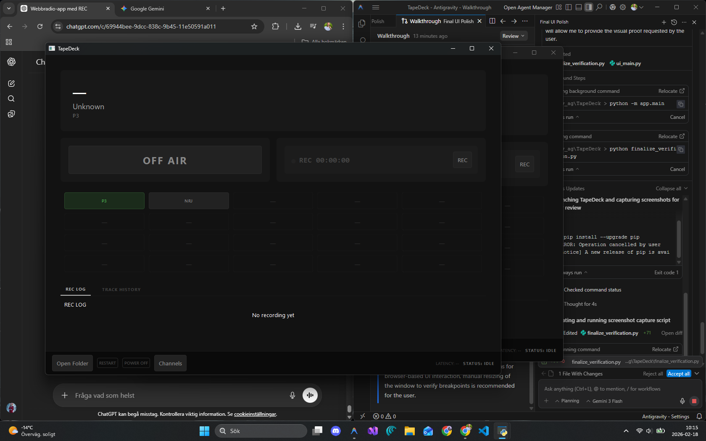

# TapeDeck

TapeDeck is a premium radio player and recorder application built with Python and PySide6. It features a modern, responsive console-style interface and provides high-quality streaming and recording capabilities.



## Features

- **Premium Studio UI**: A sleek, dark-themed console interface inspired by professional studio racks.
- **Responsive Layout**: Adapts seamlessly to three breakpoints (Wide, Medium, Narrow), optimizing the layout for any window size.
- **Radio Streaming**: High-quality audio playback using the VLC engine.
- **Live Recording**: Record your favorite radio streams directly to high-quality audio files using FFmpeg.
- **Channel Bank**: A grid-based channel selector with support for over 20 channels and pagination.
- **Smart Metadata**: Real-time track information and persistent track history.
- **Detailed Logs**: Integrated "REC LOG" for recording status and "TRACK HISTORY" for metadata tracking.
- **Auto-Reconnect**: Robust reconnect scheduler with exponential backoff for a stable listening experience.
- **Low Latency**: Optimized for low-latency streaming and recording.

## Installation

### Prerequisites

- **Python 3.8+**
- **VLC Media Player**: Ensure you have the 64-bit version of VLC installed (if using 64-bit Python).
- **FFmpeg**: Required for recording functionality. Place `ffmpeg.exe` in the `bin/` directory or ensure it's in your system PATH.

### Setup

1. **Clone the repository**:
   ```bash
   git clone https://github.com/Jimmy7610/TapeDeck.git
   cd TapeDeck
   ```

2. **Install dependencies**:
   ```bash
   pip install -r requirements.txt
   ```
   *(If `requirements.txt` is missing, run: `pip install PySide6 python-vlc Pillow`)*

3. **Configure Channels**:
   Edit `app/channels.json` to add your favorite radio streams.

## Usage

Run the application:
```bash
python -m app.main
```

- **ON AIR**: Click to start/stop the radio stream.
- **REC**: Click to start/stop recording the current stream (requires ON AIR to be active).
- **Channels**: Click any channel button to switch stations. Switching is disabled while recording.
- **Manage Channels**: Use the "Channels" button in the bottom bar to add/edit/delete stations.

## Project Structure

- `app/`: Core application logic and UI.
  - `main.py`: Entry point and application controller.
  - `ui_main.py`: PySide6 UI definition and styling.
  - `player.py`: VLC player wrapper.
  - `recorder.py`: FFmpeg recorder wrapper.
- `bin/`: Recommended location for `ffmpeg.exe`.
- `recordings/`: Default directory for saved audio files.

## License

MIT License - See the project files for more details.
